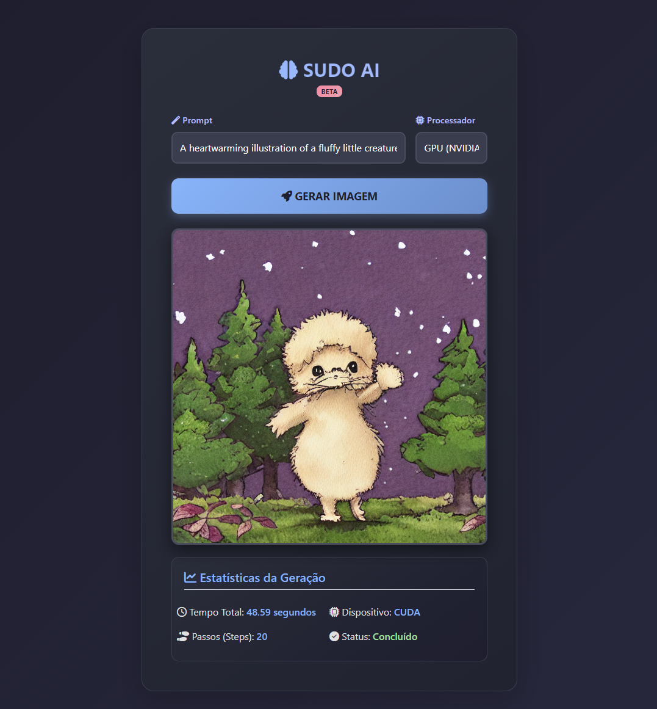

# 🎨 SUDO AI Generator

> **IA Generativa Text-to-Image rodando localmente com otimização de hardware.**

O **SUDO AI Generator** é uma aplicação full-stack que democratiza o acesso à Inteligência Artificial Generativa. O projeto executa o modelo **Stable Diffusion v1.5** localmente, permitindo a criação de imagens ilimitadas sem custos de API, sem censura e com total privacidade de dados.

O diferencial deste projeto é a engenharia de otimização realizada para permitir que modelos pesados de Deep Learning rodem em hardware de consumo (GPUs com 4GB VRAM) sem erros de memória.

---



---

## 🚀 Funcionalidades

* **Geração Text-to-Image:** Converta prompts de texto em imagens artísticas ou realistas.
* **Processamento Híbrido:** Escolha em tempo real entre processamento via **GPU (CUDA)** para velocidade ou **CPU** para compatibilidade.
* **Interface Web Responsiva:** Front-end moderno construído com HTML5, Bootstrap e JavaScript.
* **Feedback em Tempo Real:** Barra de progresso visual sincronizada com os passos de denoising da IA.
* **Galeria Automática:** Sistema de salvamento automático que organiza as gerações em disco com timestamp e nome do prompt.
* **Engenharia de Prompt:** Suporte a prompts longos e complexos.

---

## 🛠️ Tecnologias Utilizadas

* **Linguagem:** Python 3.10+
* **Backend:** Flask (Microframework Web)
* **Core IA:** PyTorch & Hugging Face Diffusers
* **Modelo:** Stable Diffusion v1.5
* **Frontend:** HTML5, CSS3, JavaScript (Vanilla), Bootstrap 5

---

## ⚙️ Engenharia e Otimização (Desafios Técnicos)

Um dos maiores desafios deste projeto foi a gestão de memória VRAM em placas da série **GTX 16xx**. Foram implementadas as seguintes soluções no `engine.py`:

1.  **Sequential CPU Offload:** Implementação de gerenciamento de memória que move camadas do modelo dinamicamente entre RAM e VRAM, permitindo rodar um modelo de 6GB em uma placa de 4GB.
2.  **Tratamento de Precisão (Float32 vs FP16):** Correção do bug conhecido de "Tela Preta/NaN" nas GTX 1650, forçando o decodificador (VAE) a operar em precisão total (float32) enquanto o restante do modelo opera em meia precisão ou modo otimizado.
3.  **Attention Slicing:** Fatiamento do mecanismo de atenção para reduzir picos de consumo de memória.

---

## 📦 Instalação e Configuração

### Pré-requisitos
* Python 3.10 ou superior (64-bit).
* Placa de vídeo NVIDIA (Recomendado) ou CPU potente.
* Git.

### Passo a Passo

1.  **Clone o repositório:**
    ```bash
    git clone [https://github.com/seu-usuario/sudo-ai-generator.git](https://github.com/seu-usuario/sudo-ai-generator.git)
    cd sudo-ai-generator
    ```

2.  **Crie um ambiente virtual:**
    ```bash
    python -m venv .venv
    # Windows:
    .venv\Scripts\activate
    # Linux/Mac:
    source .venv/bin/activate
    ```

3.  **Instale o PyTorch (Versão CUDA):**
    *É crucial instalar a versão correta para suporte a GPU:*
    ```bash
    pip install torch torchvision torchaudio --index-url [https://download.pytorch.org/whl/cu124](https://download.pytorch.org/whl/cu124)
    ```

4.  **Instale as dependências do projeto:**
    ```bash
    pip install -r requirements.txt
    ```
    *(Conteúdo do requirements.txt: flask, diffusers, transformers, accelerate, scipy, safetensors)*

---

## 🎮 Como Usar

1.  Inicie o servidor Flask:
    ```bash
    python app.py
    ```
2.  Aguarde a mensagem: `* Running on http://127.0.0.1:5000`.
3.  Abra seu navegador e acesse `http://127.0.0.1:5000`.
4.  Digite seu prompt (ex: *"A futuristic city with neon lights, 8k, realistic"*).
5.  Selecione **GPU** (para rapidez) ou **CPU**.
6.  Clique em **Gerar Imagem**.

---

## 📂 Estrutura do Projeto

```text
/
├── app.py              # Controlador Web (Flask Routes)
├── engine.py           # Lógica de IA e Otimização de Hardware
├── requirements.txt    # Dependências
├── imagens_geradas/    # Pasta onde as imagens são salvas automaticamente
└── README.md           # Documentação
```

--- 

## ⚠️ Solução de Problemas Comuns
- Erro "CUDA not available": Certifique-se de que instalou o PyTorch com a URL ```--index-url``` correta e que seus drivers NVIDIA estão atualizados.

- Imagem Preta (Black Image): O filtro de segurança (NSFW) foi desativado nas configurações do pipeline para evitar falsos positivos e garantir a geração da imagem.

- Erro de Memória (OOM): Se o PC travar, feche outros programas (Chrome, Jogos) para liberar RAM e VRAM.